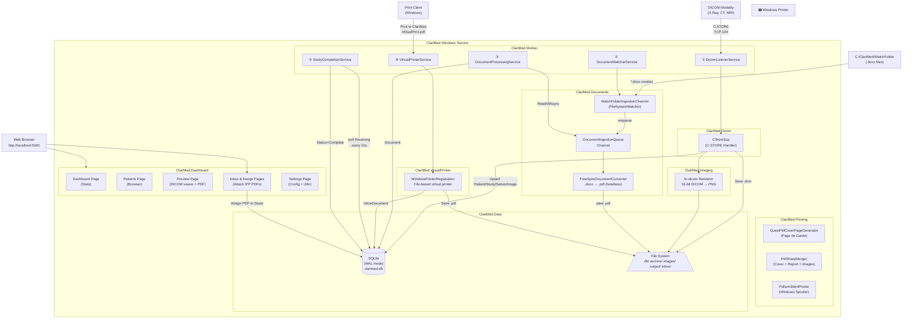

# ClariMed

**Clari**ty + **Med**ical — A Windows Background Service for medical imaging and reporting with a Razor Pages dashboard (Areas pattern). Receives DICOM images from medical devices (X-Ray, CT, MRI), ingests `.docx` reports from a watch folder, receives PDFs via a built-in Virtual Printer, generates a professional PDF (cover page + report + images), and prints silently to a local Windows printer. Includes a web dashboard at `http://localhost:5000`.

---

## Table of Contents

1. [What It Does](#what-it-does)
2. [System Architecture](#system-architecture)
3. [Project Structure](#project-structure)
4. [How Each Layer Works](#how-each-layer-works)
5. [Background Services](#background-services)
6. [Data Model](#data-model)
7. [Key Abstractions & Interfaces](#key-abstractions--interfaces)
8. [Technology Stack](#technology-stack)
9. [File System Layout](#file-system-layout)
10. [Configuration Reference](#configuration-reference)
11. [Database & WAL Mode](#database--wal-mode)
12. [Build, Run & Migrations](#build-run--migrations)
13. [Core Optimizations & Bug Fixes](#core-optimizations--bug-fixes)
14. [Future Roadmap](#future-roadmap)

---

## What It Does

ClariMed runs as a Windows Service and operates parallel, fully asynchronous pipelines, plus a Razor Pages dashboard:

| Pipeline               | Input                                             | Output                                                           |
| ---------------------- | ------------------------------------------------- | ---------------------------------------------------------------- |
| **DICOM Ingestion**    | Images from X-Ray / CT / MRI over TCP port 104    | `.dcm` archive + `.png` images + SQLite records                  |
| **Document Ingestion** | `.docx` files dropped into a watch folder         | Converted `.pdf` + SQLite `Document` record                      |
| **Virtual Printer**    | PDFs printed to "ClariMed" Windows printer        | PDF stored in `InboxDocument` waiting for assignment             |
| **Merge & Print**      | Generated directly via Study Preview             | Final merged PDF (cover + report + images) → silent print        |
| **Dashboard**          | Web browser at `http://localhost:5000`            | Study viewer, patient browser, inbox assignment, settings page   |

---

## System Architecture



---

## Project Structure

```
D:\ClariMed\
├── ClariMed.slnx                         ← XML solution (not .sln)
├── AGENTS.md                             ← Architecture rules for AI agents
├── README.md                             ← This file
│
├── src/
│   ├── ClariMed.Data/                    ← Data access layer (EF Core 8)
│   ├── ClariMed.Dicom/                   ← DICOM network layer (fo-dicom)
│   ├── ClariMed.Documents/               ← Document watcher + Spire conversion
│   ├── ClariMed.Imaging/                 ← Image conversion utilities
│   ├── ClariMed.Printing/                ← PDF generation + QuestPDF cover + silent printing
│   ├── ClariMed.VirtualPrinter/          ← File-based virtual printer registration
│   ├── ClariMed.Dashboard/               ← Razor Pages web interface
│   ├── ClariMed.Notifier/                ← Standalone WinForms app for virtual printer notifications
│   └── ClariMed.Worker/                  ← Windows Service orchestrator
│
└── tests/
    └── (placeholder for ClariMed.Tests)
```

---

## How Each Layer Works

### ClariMed.Data

- **EF Core 8** with **SQLite** in **WAL mode** (Write-Ahead Logging).
- Repository pattern: every entity has an `IXxxRepository` + `XxxRepository` registered as **scoped**.
- SQLite WAL mode is configured via `WalModeInterceptor` on all database connections to support concurrent access from multiple background services.

### ClariMed.Dicom

- `CStoreScp` handles C-STORE requests: extracts DICOM tags → upserts `Patient → Study → Series → DicomImage` → saves `.dcm` → converts pixels to `.png`.
- Custom stable folder hashing (FNV-1a) is used to group study files deterministically.

### ClariMed.Documents

- **Producer-Consumer** pattern via `System.Threading.Channels`.
- `WatchFolderIngestionChannel` monitors for new `.docx` files.
- `FreeSpire.Doc` performs headless `.docx` → `.pdf` conversion. Note that FreeSpire has a 3-page / 500-paragraph limit per conversion.

### ClariMed.VirtualPrinter

- **File-based virtual printer**: `WindowsPrinterRegistration` registers a Windows printer named "ClariMed" using the "Microsoft Print To PDF" driver, with a file port pointing to `VirtualPrint.pdf` in the watch folder.
- `VirtualPrinterService` uses `FileSystemWatcher` to detect when `VirtualPrint.pdf` is created or changed, reads it, saves to `data/inbox`, and creates an `InboxDocument` in the DB.
- Requires Admin for PowerShell printer registration; failure is non-fatal (logged as warning).
- Integrates with a local Windows Form Notifier popup (`AssignForm.cs`) to prompt the user instantly on incoming print jobs.

### ClariMed.Printing

- **Cover page**: generated dynamically via QuestPDF using `pagegarde.docx` details.
- **PDF Merge**: PdfSharpCore opens cover, report, and resized DICOM plates and appends pages.
- **Silent print**: PdfiumViewer loads the final PDF and submits to the Windows spooler.

### ClariMed.Dashboard

A Razor Pages class library integrated via the ASP.NET Core **Areas pattern**.

#### Key Pages
* **Dashboard (`/dashboard`)**: System metrics and recent studies.
* **Inbox (`/inbox`)**: Workspace for matching incoming PDFs from the Virtual Printer directly to patient studies. Once linked, it automatically opens the study's preview page.
* **Patients (`/patients`)**: Searchable browser for all studies.
* **Preview (`/preview/{id}`)**: Interactive workspace for organizing study images, adjusting gap size / images per page, and generating the final medical report PDF.
* **Settings (`/settings`)**: Clinic configuration and localization (i18n).

---

## Background Services

| #   | Service                     | What it does                                                                                                                                                         |
| --- | --------------------------- | -------------------------------------------------------------------------------------------------------------------------------------------------------------------- |
| 1   | `DicomListenerService`      | Opens TCP port 104 as the configured AE Title. Keeps the DICOM server alive.                                                                                         |
| 2   | `DocumentWatcherService`    | Calls `StartAsync` on every registered `IDocumentIngestionChannel`. Currently: `WatchFolderIngestionChannel`.                                                        |
| 3   | `DocumentProcessingService` | Drains `DocumentIngestionQueue` with `ReadAllAsync`. Converts each `.docx` to PDF, saves `Document` record.                                                           |
| 4   | `StudyCompletionService`    | Polls every 10 seconds for studies in `Receiving` status whose `LastImageReceivedAt` exceeds the stabilization window (default 30s). Sets `Status=Complete`.         |
| 5   | `VirtualPrinterService`     | Detects `VirtualPrint.pdf` in watch folder via `FileSystemWatcher`, imports as inbox document. Registers Windows printer via PowerShell.                                |
| 6   | `RecycleBinCleanupService`  | Runs every 12 hours. Permanently deletes soft-deleted studies older than 30 days (files + DB records).                                                                |

---

## Data Model

```mermaid
erDiagram
    PATIENT ||--o{ STUDY : "has"
    STUDY ||--o{ SERIES : "contains"
    SERIES ||--o{ DICOM-IMAGE : "holds"
    DOCUMENT }o--o| STUDY : "links to"
    STUDY ||--o| INBOX-DOCUMENT : "assigns"

    STUDY {
        int Id
        string StudyInstanceUid
        int PatientId
        string AccessionNumber
        string Modality
        StudyStatus Status
    }

    DICOM-IMAGE {
        int Id
        string SopInstanceUid
        int SeriesId
        string FilePath
    }

    DOCUMENT {
        int Id
        string OriginalFileName
        string? PdfFilePath
        DocumentStatus Status
        int? StudyId
    }

    INBOX-DOCUMENT {
        int Id
        string FileName
        string PdfPath
        InboxDocumentStatus Status
        int? AssignedToStudyId
    }

    CLINIC-SETTINGS {
        int Id
        string ClinicName
        int DicomPort
        string DatabasePath
    }
```

---

## Key Abstractions & Interfaces

| Interface                   | Implementation                    |
| --------------------------- | --------------------------------- |
| `IDocumentIngestionChannel` | `WatchFolderIngestionChannel`     |
| `IDocumentConverter`        | `SpireDocumentConverter`          |
| `ICoverPageGenerator`       | `QuestPdfCoverPageGenerator`      |
| `IPdfMerger`                | `PdfSharpMerger`                  |
| `ISilentPdfPrinter`         | `PdfiumSilentPrinter`             |
| `IImageConverter`           | `ImageConverter`                  |
| `IDicomServer`              | `DicomServer`                     |

---

## Technology Stack

| Package                                      | Version                  | Purpose                                     |
| -------------------------------------------- | ------------------------ | ------------------------------------------- |
| .NET                                         | 10.0 (`net10.0-windows`) | Runtime — Windows-only for printing support |
| fo-dicom                                     | 5.1.2                    | DICOM C-STORE SCP network server            |
| FreeSpire.Doc                                | 14.4.0                   | Headless `.docx → PDF` (No Word required)   |
| QuestPDF                                     | 2024.10.2                | Fluent A4 PDF cover + dashboard PDF gen     |
| PdfSharpCore                                 | 1.3.67                   | PDF merging (append pages + draw images)    |
| PdfiumViewer                                 | 2.13.0                   | Silent PDF printing via Windows spooler     |
| EF Core SQLite                               | 8.0.0                    | Database engine (WAL mode)                  |
| ASP.NET Core Razor Pages                     | 10.0                     | Interactive web dashboard (Areas pattern)   |

---

## File System Layout

```
C:\ClariMed\
├── WatchFolder\          ← Drop .docx files here (also VirtualPrint.pdf lands here)
├── Documents\            ← Converted PDFs (.docx → .pdf output)
└── Output\               ← Final merged PDFs (Cover + Report + Images)

D:\ClariMed\              ← Working directory
├── db\
│   └── clarimed.db       ← SQLite database (WAL mode)
└── data\
    ├── archive\          ← Raw .dcm files organized by Patient/Study/Series
    ├── images\           ← Converted PNG files (mirror of archive structure)
    └── inbox\            ← PDFs captured from the Virtual Printer
```

---

## Configuration Reference

Settings live in `src/ClariMed.Worker/appsettings.json` (also overridden by the database `ClinicSettings` table — DB takes precedence for most settings at runtime):

| Key                     | Default                   | Description                                            |
| ----------------------- | ------------------------- | ------------------------------------------------------ |
| `DicomPort`             | `104`                     | TCP port the DICOM C-STORE SCP listens on              |
| `AETitle`               | `CLARIMED`                | DICOM Application Entity Title                         |
| `DatabasePath`          | `C:\ClariMed\clarimed.db` | Path to SQLite database file                           |
| `ArchivePath`           | `data/archive`            | Root path for raw `.dcm` file storage                  |
| `WatchFolderPath`       | `C:\ClariMed\WatchFolder` | Folder monitored for incoming `.docx` files            |
| `StudyStabilizationSeconds` | `30`                  | Config-only: seconds before a study is marked Complete |

---

## Database & WAL Mode

ClariMed uses SQLite in **WAL (Write-Ahead Logging)** mode for safe concurrent access between background services and the Dashboard.

### Migrations
```bash
# Add a new migration
dotnet ef migrations add <MigrationName> --project src\ClariMed.Data --startup-project src\ClariMed.Worker

# Apply migrations (also runs automatically on startup via db.Database.Migrate())
dotnet ef database update --project src\ClariMed.Data --startup-project src\ClariMed.Worker
```

---

## Build, Run & Migrations

```bash
# Restore all NuGet packages
dotnet restore D:\ClariMed\ClariMed.slnx

# Build the entire solution
dotnet build D:\ClariMed\ClariMed.slnx

# Run in console mode (keeps running until Ctrl+C)
dotnet run --project src\ClariMed.Worker

# Run with auto-reload on code changes (locks prevented)
dotnet watch run --project src\ClariMed.Worker
```

> **Important:** Use `D:\ClariMed\ClariMed.slnx` (not `.sln`). Tools that expect `.sln` will fail.

---

## Core Optimizations & Bug Fixes

We have modernized and optimized the system to address several development and performance issues:

### 1. File Locks during `dotnet watch`
Previously, `dotnet watch` would frequently throw `MSB3026` or `MSB3021` file copying lock errors because the worker process was holding locks on compiled `.dll` files. This was fixed by setting `<UseAppHost>false</UseAppHost>` in `ClariMed.Worker.csproj`, enabling a clean, seamless developer workflow.

### 2. Stable Directory Hashing (FNV-1a)
To prevent process restarts from scrambling the study folder names on disk (due to the volatile `GetHashCode()` implementation in .NET Core), we implemented a deterministic FNV-1a hash function (`GetStableHashCode`). Patient study images now reliably and permanently reside in the same physical directory structure.

### 3. Hyper-Fast PDF Generation
We added server-side image resizing and JPEG compression in [Preview.cshtml.cs](file:///d:/ClariMed/src/ClariMed.Dashboard/Areas/Dashboard/Pages/Preview.cshtml.cs). Images exceeding A4 bounds are scaled down in-memory and compressed with a JPEG encoder at 75% quality, reducing full PDF compilation times to **under 2 seconds** even for massive image sets.

### 4. Zero Thumbnail Console 404 Errors
The preview sidebar no longer requests non-existent `_thumb.png` files, eliminating console errors. Small previews load the optimized PNGs directly (lazy-loaded).

### 5. Assignment Workspace Workflow
Linking an incoming Virtual Printer PDF from the Inbox now immediately redirects the doctor to the patient study's `/preview/{studyId}` workspace, bypassing extra clicks.

---

## Future Roadmap

| Feature               | Description                                             |
| --------------------- | ------------------------------------------------------- |
| Authentication        | `BCrypt.Net-Next` for admin login on Dashboard          |
| Archive Cleanup       | Auto-move old studies after `ArchiveIntervalMonths`     |
| Multi-printer routing | Route print jobs to different printers by modality      |
#