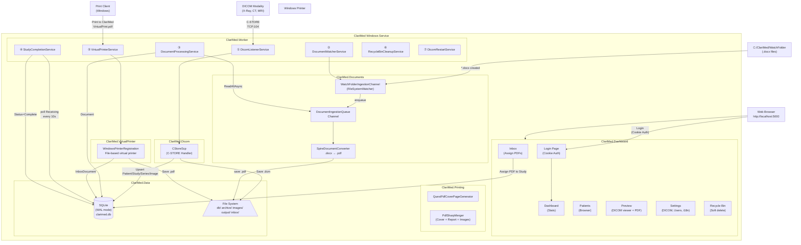
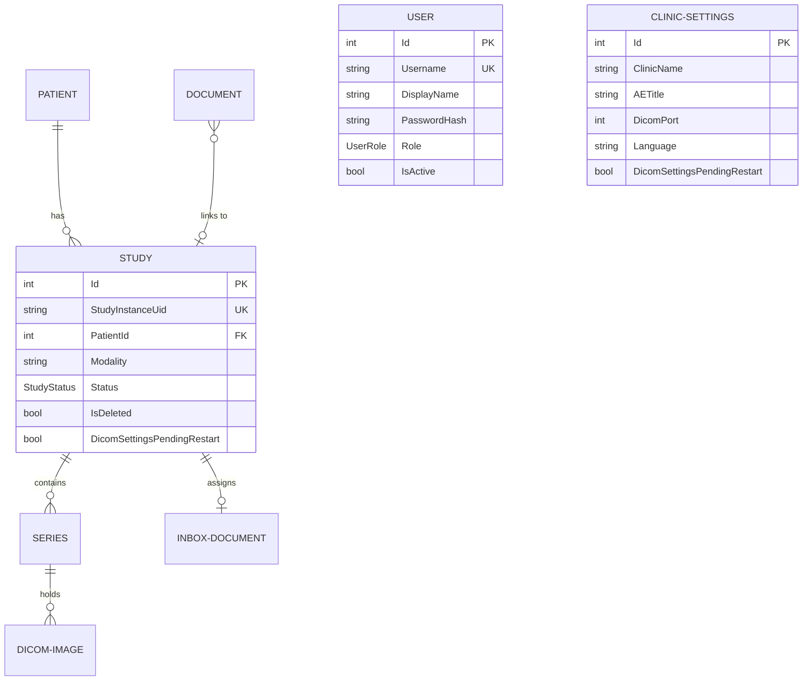

# ClariMed

**Clari**ty + **Med**ical — A Windows Background Service for medical imaging and reporting with a Razor Pages dashboard (Areas pattern). Receives DICOM images from medical devices (X-Ray, CT, MRI), ingests `.docx` reports from a watch folder, receives PDFs via a built-in Virtual Printer, generates a professional PDF (cover page + report + images), and prints silently to a local Windows printer. Includes a secure web dashboard at `http://localhost:5000`.

---

## Table of Contents

1. [What It Does](#what-it-does)
2. [System Architecture](#system-architecture)
3. [Project Structure](#project-structure)
4. [How Each Layer Works](#how-each-layer-works)
5. [Background Services](#background-services)
6. [Data Model](#data-model)
7. [Authentication & User Management](#authentication--user-management)
8. [Settings Dashboard](#settings-dashboard)
9. [Technology Stack](#technology-stack)
10. [File System Layout](#file-system-layout)
11. [Configuration Reference](#configuration-reference)
12. [Database & WAL Mode](#database--wal-mode)
13. [Build, Run & Migrations](#build-run--migrations)
14. [Core Optimizations](#core-optimizations)

---

## What It Does

ClariMed runs as a Windows Service and operates parallel, fully asynchronous pipelines, plus a secure Razor Pages dashboard:

| Pipeline               | Input                                             | Output                                                           |
| ---------------------- | ------------------------------------------------- | ---------------------------------------------------------------- |
| **DICOM Ingestion**    | Images from X-Ray / CT / MRI over TCP port 104    | `.dcm` archive + `.png` images + SQLite records                  |
| **Document Ingestion** | `.docx` files dropped into a watch folder         | Converted `.pdf` + SQLite `Document` record                      |
| **Virtual Printer**    | PDFs printed to "ClariMed" Windows printer        | PDF stored in `InboxDocument` waiting for assignment             |
| **Merge & Print**      | Generated directly via Study Preview             | Final merged PDF (cover + report + images) → silent print        |
| **Dashboard**          | Web browser at `http://localhost:5000`            | Secure study viewer, patient browser, inbox, settings, users     |

---

## System Architecture



---

## Project Structure

```
ClariMed/
├── ClariMed.slnx                         ← XML solution (not .sln)
├── AGENTS.md                             ← Architecture rules for AI agents
├── README.md                             ← This file
│
├── src/
│   ├── ClariMed.Data/                    ← Data access layer (EF Core 8 + SQLite)
│   ├── ClariMed.Dicom/                   ← DICOM network layer (fo-dicom)
│   ├── ClariMed.Documents/               ← Document watcher + Spire conversion
│   ├── ClariMed.Imaging/                 ← DICOM pixel → PNG conversion
│   ├── ClariMed.Printing/                ← PDF generation (QuestPDF + PdfSharpCore)
│   ├── ClariMed.VirtualPrinter/          ← File-based virtual printer registration
│   ├── ClariMed.Dashboard/               ← Razor Pages web interface (Areas pattern)
│   ├── ClariMed.Notifier/                ← Standalone WinForms tray app
│   └── ClariMed.Worker/                  ← Windows Service orchestrator
│
└── tests/
    └── (placeholder for ClariMed.Tests)
```

---

## How Each Layer Works

### ClariMed.Data

- **EF Core 8** with **SQLite** in **WAL mode** (Write-Ahead Logging).
- Repository pattern: every entity has an `IXxxRepository` + `XxxRepository` registered as **scoped**.
- SQLite WAL mode is configured via `WalModeInterceptor` on all database connections.
- `User` entity with BCrypt-hashed passwords for authentication.
- `ClinicSettings` singleton row with auto-seeding on first access.

### ClariMed.Dicom

- `CStoreScp` handles C-STORE requests: extracts DICOM tags → upserts `Patient → Study → Series → DicomImage` → saves `.dcm` → converts pixels to `.png`.
- Custom stable folder hashing (FNV-1a) is used to group study files deterministically.
- `DicomFileIngestionService` supports batch import from local folders.

### ClariMed.Documents

- **Producer-Consumer** pattern via `System.Threading.Channels`.
- `WatchFolderIngestionChannel` monitors for new `.docx` files.
- `FreeSpire.Doc` performs headless `.docx` → `.pdf` conversion (3-page / 500-paragraph free tier limit).

### ClariMed.VirtualPrinter

- **File-based virtual printer**: `WindowsPrinterRegistration` registers a "ClariMed" Windows printer using "Microsoft Print To PDF" driver with a file port.
- `VirtualPrinterService` uses `FileSystemWatcher` to detect `VirtualPrint.pdf`, reads it, saves to `data/inbox`, creates an `InboxDocument`.
- Requires Admin for PowerShell printer registration; failure is non-fatal.

### ClariMed.Printing

- **Cover page**: generated via QuestPDF using `pagegarde.docx` template (FreeSpire fallback).
- **PDF Merge**: PdfSharpCore appends cover, report, and DICOM images onto A4 pages.
- **Silent print**: PdfiumViewer submits to the Windows spooler.

### ClariMed.Dashboard

Razor Pages class library using the ASP.NET Core **Areas pattern**. All pages require authentication.

| Page | URL | Purpose |
|------|-----|---------|
| **Login** | `/login` | Cookie-based authentication (standalone, matches dashboard style) |
| **Dashboard** | `/dashboard` | System metrics, today's modality breakdown, recent studies |
| **Patients** | `/patients` | Searchable/filterable study directory (max 500 results) |
| **Inbox** | `/inbox` | Virtual Printer inbox — assign PDFs to patient studies |
| **Preview** | `/preview/{id}` | Full study viewer with drag-reorder, PDF generation, print |
| **Recycle Bin** | `/recyclebin` | Soft-deleted studies — restore or permanent delete |
| **Settings** | `/settings` | Clinic config, DICOM, file paths, user management (5 sections) |

---

## Background Services

| #   | Service                     | What it does |
| --- | --------------------------- | ------------ |
| 1   | `DicomListenerService`      | Opens TCP port 104 as the configured AE Title. Keeps the DICOM server alive. |
| 2   | `DocumentWatcherService`    | Calls `StartAsync` on every registered `IDocumentIngestionChannel`. |
| 3   | `DocumentProcessingService` | Drains `DocumentIngestionQueue`. Converts `.docx` to PDF, saves `Document` record. |
| 4   | `StudyCompletionService`    | Polls every 10s. Studies in `Receiving` older than stabilization window → `Complete`. |
| 5   | `VirtualPrinterService`     | Detects `VirtualPrint.pdf` via `FileSystemWatcher`, imports as inbox document. |
| 6   | `RecycleBinCleanupService`  | Every 12 hours. Permanently deletes soft-deleted studies > 30 days old. |
| 7   | `DicomRestartService`       | Polls every 5s. When DICOM settings change, waits for idle → restarts server. |

---

## Data Model



---

## Authentication & User Management

### Authentication

- **Cookie-based** ASP.NET Core authentication (no external packages needed).
- All dashboard pages require login (`[Authorize]` in `_ViewImports.cshtml`).
- Login page at `/login` — standalone, matches the dashboard's Tailwind/Alpine.js design.
- Session expires after 24 hours with sliding renewal.
- **Default credentials**: `admin` / `admin` (seeded on first run).

### Roles

| Role | Permissions |
|------|------------|
| **Admin** (doctor) | Full access: all settings sections, DICOM config, user management |
| **User** (technician) | View-only: Dashboard, Patients, Preview, Inbox. No settings access. |

### User Management (Admin only)

- Add new users with username, display name, password, and role.
- Activate/deactivate accounts.
- Delete users (cannot delete your own admin account).
- Passwords stored with BCrypt (salted, slow hash).

---

## Settings Dashboard

The Settings page (`/settings`) has 5 HTMX-switched sections:

### 1. General
- Language selector (English / French)

### 2. Clinic Info
- **Clinic Name** — displayed on cover pages and reports
- **Report Notes** — medical text shown between cover page and images

### 3. DICOM Settings
- **Server Status** — live indicator (Active / Restart pending)
- **AE Title** — DICOM Application Entity title (must match modality config)
- **DICOM Port** — TCP port for C-STORE connections (default: 104)
- Changes auto-restart the server when idle (no receiving studies)

### 4. File Paths
- **Archive Path** — root path for raw `.dcm` storage
- **Watch Folder Path** — folder monitored for `.docx` files

### 5. User Management (Admin only)
- Table of all users with role, status, and actions
- Add user form with username, display name, password, role
- Activate/deactivate/delete actions per user

### DICOM Auto-Restart

When an admin changes AE Title or port:
1. Settings save to DB with `DicomSettingsPendingRestart = true`
2. `DicomRestartService` polls every 5 seconds
3. Waits for all studies to leave `Receiving` status (no active data flow)
4. Stops the DICOM server, restarts with new settings
5. Clears the pending flag

---

## Technology Stack

| Package                                      | Version                  | Purpose                                     |
| -------------------------------------------- | ------------------------ | ------------------------------------------- |
| .NET                                         | 10.0 (`net10.0-windows`) | Runtime — Windows-only for printing support |
| fo-dicom                                     | 5.1.2                    | DICOM C-STORE SCP network server            |
| FreeSpire.Doc                                | 14.4.0                   | Headless `.docx → PDF` (No Word required)   |
| QuestPDF                                     | 2024.10.2                | Fluent A4 PDF cover + dashboard PDF gen     |
| PdfSharpCore                                 | 1.3.67                   | PDF merging (append pages + draw images)    |
| PdfiumViewer                                 | 2.13.0                   | Silent PDF printing via Windows spooler     |
| EF Core SQLite                               | 8.0.0                    | Database engine (WAL mode)                  |
| BCrypt.Net-Next                              | 4.0.3                    | Password hashing (bcrypt)                   |
| ASP.NET Core Razor Pages                     | 10.0                     | Interactive web dashboard (Areas pattern)   |

---

## File System Layout

```
C:\ClariMed\
├── WatchFolder\          ← Drop .docx files here (also VirtualPrint.pdf lands here)
├── Documents\            ← Converted PDFs (.docx → .pdf output)
└── Output\               ← Final merged PDFs (Cover + Report + Images)

D:\ClariMed\              ← Working directory
├── db\
│   └── clarimed.db       ← SQLite database (WAL mode)
└── data\
    ├── archive\          ← Raw .dcm files organized by Patient/Study/Series
    ├── images\           ← Converted PNG files (mirror of archive structure)
    └── inbox\            ← PDFs captured from the Virtual Printer
```

---

## Configuration Reference

Settings live in `src/ClariMed.Worker/appsettings.json` (also overridden by the database `ClinicSettings` table — DB takes precedence for most settings at runtime):

| Key                         | Default                   | Description                                            |
| --------------------------- | ------------------------- | ------------------------------------------------------ |
| `DicomPort`                 | `104`                     | TCP port the DICOM C-STORE SCP listens on              |
| `AETitle`                   | `CLARIMED`                | DICOM Application Entity Title                         |
| `DatabasePath`              | `C:\ClariMed\clarimed.db` | Path to SQLite database file                           |
| `ArchivePath`               | `data/archive`            | Root path for raw `.dcm` file storage                  |
| `WatchFolderPath`           | `C:\ClariMed\WatchFolder` | Folder monitored for incoming `.docx` files            |
| `StudyStabilizationSeconds` | `30`                      | Config-only: seconds before a study is marked Complete |

---

## Database & WAL Mode

ClariMed uses SQLite in **WAL (Write-Ahead Logging)** mode for safe concurrent access between background services and the Dashboard.

**WAL PRAGMAs** (applied on every connection):
```sql
PRAGMA journal_mode = WAL;
PRAGMA busy_timeout = 5000;
PRAGMA synchronous  = NORMAL;
PRAGMA cache_size   = -64000;   -- 64 MB
PRAGMA foreign_keys = ON;
```

### Tables

| Table | Purpose |
|-------|---------|
| `Patients` | Patient demographics (ID, name, DOB, sex) |
| `Studies` | DICOM studies with status tracking and soft delete |
| `Series` | DICOM series within studies |
| `Images` | Individual DICOM images with file paths |
| `Documents` | Converted `.docx` reports linked to studies |
| `InboxDocuments` | Virtual Printer PDFs awaiting assignment |
| `ClinicSettings` | Singleton config row (auto-seeded) |
| `Users` | Auth users with BCrypt-hashed passwords |

### Migrations

```bash
# Add a new migration
dotnet ef migrations add <MigrationName> --project src\ClariMed.Data --startup-project src\ClariMed.Worker

# Apply migrations (also runs automatically on startup via db.Database.Migrate())
dotnet ef database update --project src\ClariMed.Data --startup-project src\ClariMed.Worker
```

---

## Build, Run & Migrations

```bash
# Restore all NuGet packages
dotnet restore D:\ClariMed\ClariMed.slnx

# Build the entire solution
dotnet build D:\ClariMed\ClariMed.slnx

# Run in console mode (keeps running until Ctrl+C)
dotnet run --project src\ClariMed.Worker

# Run with auto-reload on code changes (locks prevented)
dotnet watch run --project src\ClariMed.Worker
```

> **Important:** Use `D:\ClariMed\ClariMed.slnx` (not `.sln`). Tools that expect `.sln` will fail.

### First Run

1. The app seeds a default `admin` / `admin` user
2. Open `http://localhost:5000` — redirects to login
3. Sign in with `admin` / `admin`
4. Navigate to Settings → DICOM to configure your modality connection

---

## Core Optimizations

1. **File Locks during `dotnet watch`** — `<UseAppHost>false</UseAppHost>` prevents DLL lock errors.
2. **Stable Directory Hashing (FNV-1a)** — Deterministic folder names survive process restarts.
3. **Hyper-Fast PDF Generation** — Server-side image resizing + JPEG compression at 75% quality. PDFs compile in < 2 seconds.
4. **Zero Thumbnail 404 Errors** — Preview sidebar loads optimized PNGs directly.
5. **Assignment Workflow** — Linking a Virtual Printer PDF redirects directly to the study preview.
