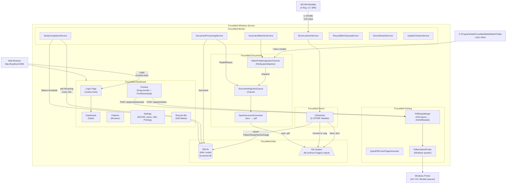
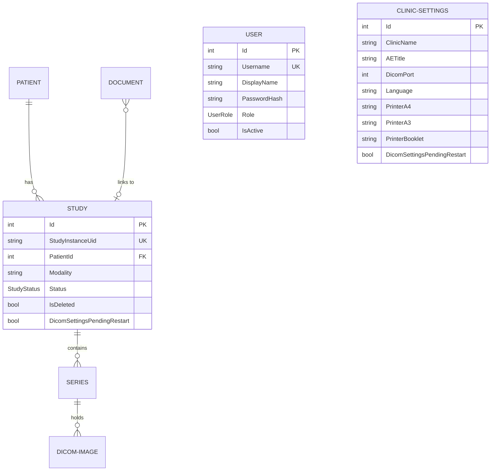

# FocusMed

**Focus** + **Med**ical — A Windows Background Service for medical imaging and reporting with a Razor Pages dashboard (Areas pattern). Receives DICOM images from medical devices (X-Ray, CT, MRI), ingests `.docx` reports from a watch folder, generates a professional PDF (cover page + report + images in grid layout), and prints silently to a local Windows printer. Includes a secure web dashboard at `http://localhost:5000`.

---

## Table of Contents

1. [What It Does](#what-it-does)
2. [System Architecture](#system-architecture)
3. [Project Structure](#project-structure)
4. [How Each Layer Works](#how-each-layer-works)
5. [Background Services](#background-services)
6. [Data Model](#data-model)
7. [Authentication & User Management](#authentication--user-management)
8. [Settings Dashboard](#settings-dashboard)
9. [Printing & Formats](#printing--formats)
10. [Technology Stack](#technology-stack)
11. [File System Layout](#file-system-layout)
12. [Configuration Reference](#configuration-reference)
13. [Database & WAL Mode](#database--wal-mode)
14. [Build, Run & Migrations](#build-run--migrations)
15. [Core Optimizations](#core-optimizations)

---

## What It Does

FocusMed runs as a Windows Service and operates parallel, fully asynchronous pipelines, plus a secure Razor Pages dashboard:

| Pipeline               | Input                                             | Output                                                           |
| ---------------------- | ------------------------------------------------- | ---------------------------------------------------------------- |
| **DICOM Ingestion**    | Images from X-Ray / CT / MRI over TCP port 1004    | `.dcm` archive + `.png` images + SQLite records                  |
| **Document Ingestion** | `.docx` files dropped into a watch folder         | Converted `.pdf` + SQLite `Document` record                      |
| **Merge & Print**      | Generated directly via Study Preview             | Final merged PDF (cover + report + images) → silent print        |
| **Dashboard**          | Web browser at `http://localhost:5000`            | Secure study viewer, patient browser, settings, users            |

---

## System Architecture



---

## Project Structure

```
FocusMed/
├── FocusMed.slnx                         ← XML solution (not .sln)
├── AGENTS.md                             ← Architecture rules for AI agents
├── README.md                             ← This file
│
├── src/
│   ├── FocusMed.Data/                    ← Data access layer (EF Core 8 + SQLite)
│   ├── FocusMed.Dicom/                   ← DICOM network layer (fo-dicom) + DicomUpsertService
│   ├── FocusMed.Documents/               ← Document watcher + Spire conversion
│   ├── FocusMed.Printing/                ← PDF generation (QuestPDF + PdfSharpCore + PdfiumViewer)
│   ├── FocusMed.Dashboard/               ← Razor Pages web interface (Areas pattern)
│   ├── FocusMed.Notifier/                ← Standalone WinForms tray app (auto-started by Worker)
│   └── FocusMed.Worker/                  ← Windows Service orchestrator
│
├── templates/
│   └── pagegarde.docx                    ← Cover page Word template
│
└── tests/
    └── (placeholder for FocusMed.Tests)
```

### Project Reference Graph

```
Worker → Dicom, Printing, Data, Documents, Dashboard
Dashboard → Data, Printing
Dicom → Data, Printing
Documents → Data
Notifier → Data
```

---

## How Each Layer Works

### FocusMed.Data

- **EF Core 8** with **SQLite** in **WAL mode** (Write-Ahead Logging).
- Repository pattern: every entity has an `IXxxRepository` + `XxxRepository` registered as **scoped**.
- SQLite WAL mode is configured via `WalModeInterceptor` on all database connections.
- `User` entity with BCrypt-hashed passwords for authentication.
- `ClinicSettings` singleton row with auto-seeding on first access.

### FocusMed.Dicom

- `CStoreScp` handles C-STORE requests: extracts DICOM tags → upserts `Patient → Study → Series → DicomImage` → saves `.dcm` → converts pixels to `.png`.
- `DicomUpsertService` — shared ingestion logic (tag extraction, entity upsert, file paths, PNG conversion, record save) used by both `CStoreScp` and `DicomFileIngestionService`.
- Custom stable folder hashing (FNV-1a) is used to group study files deterministically.
- `DicomFileIngestionService` supports batch import from local folders.
- Per-study locking via `ConcurrentDictionary<string, SemaphoreSlim>` allows parallel ingestion of different studies while serializing images within the same study.

### FocusMed.Documents

- **Producer-Consumer** pattern via `System.Threading.Channels`.
- `WatchFolderIngestionChannel` monitors for new `.docx` files.
- `FreeSpire.Doc` performs headless `.docx` → `.pdf` conversion (3-page / 500-paragraph free tier limit).

### FocusMed.Printing

- **Cover page**: generated via QuestPDF using `pagegarde.docx` template (FreeSpire fallback).
- **PDF Merge**: PdfSharpCore lays out images in a grid on A4 pages (configurable images per page, columns, gap), then optionally converts to A3 portrait or imposes for booklet (A3 landscape, saddle-stitch folding).
- **Silent print**: PdfiumViewer submits to the Windows spooler. Paper size, tray, and finishing are controlled entirely by the pre-configured Windows printer queue defaults — no driver-specific code in the application.
- **Print formats**: A4 (standard), A3 (portrait, scaled), Booklet (A3 landscape, front/back imposition).

### FocusMed.Dashboard

Razor Pages class library using the ASP.NET Core **Areas pattern**. All pages require authentication.

| Page | URL | Purpose |
|------|-----|---------|
| **Login** | `/login` | Cookie-based authentication (standalone, matches dashboard style) |
| **Dashboard** | `/dashboard` | System metrics, today's modality breakdown, recent studies |
| **Patients** | `/patients` | Searchable/filterable study directory (max 500 results) |
| **Preview** | `/preview/{id}` | Full study viewer: drag-reorder images, pick format, print or download |
| **Recycle Bin** | `/recyclebin` | Soft-deleted studies — restore or permanent delete |
| **Settings** | `/settings` | Clinic config, DICOM, file paths, printing, user management |

Each page lives in its own subfolder with `Index.cshtml` / `Index.cshtml.cs`. Only `_Layout.cshtml` remains in `Shared/`.

### FocusMed.Notifier

Standalone WinForms system tray application. Auto-started by the Worker on launch. Features:

- **Update checker**: Polls the dashboard for new release notifications.
- **Quick-assign**: Detects unassigned converted documents and pops up a window to link them to a study.
- **Single-instance**: Uses a named Mutex (`FocusMedApp`) to prevent duplicates.
- **Auto-launch**: The Worker starts the Notifier if it's not already running.

---

## Background Services

| #   | Service                     | What it does |
| --- | --------------------------- | ------------ |
| 1   | `DicomListenerService`      | Opens TCP port 1004 as the configured AE Title. Keeps the DICOM server alive. |
| 2   | `DocumentWatcherService`    | Calls `StartAsync` on every registered `IDocumentIngestionChannel`. |
| 3   | `DocumentProcessingService` | Drains `DocumentIngestionQueue`. Converts `.docx` to PDF, saves `Document` record. |
| 4   | `StudyCompletionService`    | Polls every 10s. Studies in `Receiving` older than stabilization window → `Complete`. |
| 5   | `RecycleBinCleanupService`  | Every 12 hours. Permanently deletes soft-deleted studies > 30 days old. |
| 6   | `DicomRestartService`       | Polls every 5s. When DICOM settings change, waits for idle → restarts server. |
| 7   | `UpdateCheckerService`      | Polls GitHub every hour for new releases. Stores result in `ClinicSettings`. |

---

## Data Model



---

## Authentication & User Management

### Authentication

- **Cookie-based** ASP.NET Core authentication (no external packages needed).
- All dashboard pages require login (`[Authorize]` in `_ViewImports.cshtml`).
- Login page at `/login` — standalone, matches the dashboard's Tailwind/Alpine.js design.
- Session expires after 24 hours with sliding renewal.
- **Default credentials**: `admin` / `admin` (seeded on first run).

### Roles

| Role | Permissions |
|------|------------|
| **Admin** (doctor) | Full access: all settings sections, DICOM config, user management |
| **User** (technician) | View-only: Dashboard, Patients, Preview. No settings access. |

### User Management (Admin only)

- Add new users with username, display name, password, and role.
- Activate/deactivate accounts.
- Delete users (cannot delete your own admin account).
- Passwords stored with BCrypt (salted, slow hash).

---

## Settings Dashboard

The Settings page (`/settings`) is a tabbed HTMX-driven interface with a left sidebar and right content area. It uses a single `SettingsModel` PageModel (`Settings.cshtml.cs`) with partial views for each section. All text is localized via `ILocalizationService` (`@Loc["..."]` tag helper) with English (`en.json`) and French (`fr.json`) translation files.

### Settings Page Sections

#### 1. General (`_SettingsGeneral.cshtml`)
- **Language selector** — English / French.
- **Machines (DICOM Modalities) info card** — Read-only display of the local IP, AE Title, and DICOM port.

#### 2. DICOM (`_SettingsDicom.cshtml`)
- **Server Status** — HTMX-polled live indicator (Active / Restart pending).
- **AE Title** and **DICOM Port** inputs.
- **Apply & Restart button** — Saves settings, triggers auto-restart when idle.

#### 3. Printing (`_SettingsPrinting.cshtml`)
- **Target Printer** — Single dropdown listing all Windows printer queues. Saves the selected printer name to `PrinterA4`, `PrinterA3`, and `PrinterBooklet` fields (all three point to the same physical printer). Paper size, tray, and finishing are controlled by the printer queue's own defaults in Windows — the application does not set any driver-level options.

#### 4. User Management — Admin Only (`_SettingsUsers.cshtml`)
- **Add User form** — Username, Display Name, Password (min 6), Role.
- **Users Table** — Toggle Active/Inactive, Delete, Change Password.

### DICOM Auto-Restart Flow

When an admin changes AE Title or port:

1. `OnPostDicomAsync()` saves with `DicomSettingsPendingRestart = true`
2. `DicomRestartService` polls every 5s, waits for no receiving studies
3. Restarts DICOM server with new settings, clears flag
4. Dashboard polls status every 3s to show the user

---

## Printing & Formats

### How Printing Works

1. User opens Preview page for a study
2. User arranges images (drag to reorder, toggle inclusion, set images per page / columns / gap)
3. User picks a print format from the dropdown: **A4**, **A3**, or **Booklet**
4. User clicks **Imprimer** (silent print) or **Télécharger** (download PDF)
5. Server generates the PDF with the same grid layout shown in the preview, then applies the format transform

### Print Formats

| Format | Description |
|--------|-------------|
| **A4** | Standard A4 portrait. Images arranged in a grid (configurable images per page, columns, gap). |
| **A3** | A3 portrait. Each A4 grid page is scaled to fill an A3 portrait page. |
| **Booklet** | A3 landscape, saddle-stitch imposition. A4 grid pages are paired side-by-side on A3 landscape sheets (front/back). Print, fold, staple. |

### API Endpoints

| Endpoint | Method | Purpose |
|----------|--------|---------|
| `/api/print/silent/{studyId}?printFormat=N` | POST | Generate PDF + send to printer silently |
| `/api/print/download/{studyId}?printFormat=N` | POST | Generate PDF + return as file download |
| `/api/print/silent-existing/{studyId}?printFormat=N&file=X` | POST | Print an already-generated PDF file |

All endpoints accept a `PrintJobRequest` body with image ordering and layout parameters:

```json
{
  "OrderedImagePaths": ["/dicom-images/patient/study/IMG_1.png", "..."],
  "ImagesPerPage": 8,
  "ColumnsPerRow": 2,
  "GapPx": 2
}
```

### Printer Configuration

- **Settings → Printing**: One dropdown to select the Windows printer queue.
- The selected printer name is stored in `PrinterA4`, `PrinterA3`, and `PrinterBooklet` (all identical — one physical printer).
- No driver-level paper size, tray, or finishing code exists in the application. All formatting is handled by the Windows printer queue defaults.
- If no printer is selected, print/download endpoints return a 400 error.

---

## Technology Stack

| Package                                      | Version                  | Purpose                                     |
| -------------------------------------------- | ------------------------ | ------------------------------------------- |
| .NET                                         | 10.0 (`net10.0-windows`) | Runtime — Windows-only for printing support |
| fo-dicom                                     | 5.1.2                    | DICOM C-STORE SCP network server            |
| FreeSpire.Doc                                | 14.4.0                   | Headless `.docx → PDF` (No Word required)   |
| QuestPDF                                     | 2024.10.2                | Fluent A4 PDF cover + dashboard PDF gen     |
| PdfSharpCore                                 | 1.3.67                   | PDF merging (grid layout + A3/booklet imposition) |
| PdfiumViewer                                 | 2.13.0                   | Silent PDF printing via Windows spooler     |
| EF Core SQLite                               | 8.0.0                    | Database engine (WAL mode)                  |
| BCrypt.Net-Next                              | 4.0.3                    | Password hashing (bcrypt)                   |
| ASP.NET Core Razor Pages                     | 10.0                     | Interactive web dashboard (Areas pattern)   |

---

## File System Layout

```
./data/
├── WatchFolder/          ← Drop .docx files here
├── Documents/            ← Converted PDFs (.docx → .pdf output)
├── Output/               ← Final merged PDFs (Cover + Report + Images)
├── db/
│   └── focusmed.db       ← SQLite database (WAL mode)
├── archive/              ← Raw .dcm files organized by Patient/Study/Series
└── images/               ← Converted PNG files (mirror of archive structure)
```

---

## Configuration Reference

Settings live in `src/FocusMed.Worker/appsettings.json` (also overridden by the database `ClinicSettings` table — DB takes precedence for most settings at runtime):

| Key                         | Default                   | Description                                            |
| --------------------------- | ------------------------- | ------------------------------------------------------ |
| `DicomPort`                 | `1004`                     | TCP port the DICOM C-STORE SCP listens on              |
| `AETitle`                   | `FOCUSMED`                | DICOM Application Entity Title                         |
| `DatabasePath`              | `data/db/focusmed.db`     | Path to SQLite database file                           |
| `ArchivePath`               | `data/archive`            | Root path for raw `.dcm` file storage                  |
| `ImagesPath`                | `data/images`             | Root path for converted `.png` files                   |
| `WatchFolderPath`           | `data/WatchFolder`        | Folder monitored for incoming `.docx` files            |
| `StudyStabilizationSeconds` | `30`                      | Config-only: seconds before a study is marked Complete |

---

## Database & WAL Mode

FocusMed uses SQLite in **WAL (Write-Ahead Logging)** mode for safe concurrent access between background services and the Dashboard.

**WAL PRAGMAs** (applied on every connection):
```sql
PRAGMA journal_mode = WAL;
PRAGMA busy_timeout = 5000;
PRAGMA synchronous  = NORMAL;
PRAGMA cache_size   = -64000;   -- 64 MB
PRAGMA foreign_keys = ON;
```

### Tables

| Table | Purpose |
|-------|---------|
| `Patients` | Patient demographics (ID, name, DOB, sex) |
| `Studies` | DICOM studies with status tracking and soft delete |
| `Series` | DICOM series within studies |
| `Images` | Individual DICOM images with file paths |
| `Documents` | Converted `.docx` reports linked to studies |
| `ClinicSettings` | Singleton config row (auto-seeded) |
| `Users` | Auth users with BCrypt-hashed passwords |

### Performance Indexes

- **`Patient`**: `PatientId` (index), `Name` (index)
- **`Study`**: `StudyInstanceUid` (unique index), `StudyDate` (index), `Modality` (index), `Status` (index), `IsDeleted` (index), `AccessionNumber` (index), `CreatedAt` (index), `DeletedAt` (index)
- **`Series`**: `SeriesInstanceUid` (unique index)
- **`DicomImage`**: `SopInstanceUid` (unique index)
- **`Document`**: `Status` (index), `ReceivedAt` (index), `StudyId` (index)
- **`User`**: `Username` (unique index)

### Migrations

```bash
# Add a new migration
dotnet ef migrations add <MigrationName> --project src\FocusMed.Data --startup-project src\FocusMed.Worker

# Apply migrations (also runs automatically on startup via db.Database.Migrate())
dotnet ef database update --project src\FocusMed.Data --startup-project src\FocusMed.Worker
```

---

## Build, Run & Migrations

```bash
# Restore all NuGet packages
dotnet restore D:\ClariMed\FocusMed.slnx

# Build the entire solution
dotnet build D:\ClariMed\FocusMed.slnx

# Run in console mode (keeps running until Ctrl+C)
dotnet run --project src\FocusMed.Worker

# Run with auto-reload on code changes (locks prevented)
dotnet watch run --project src\FocusMed.Worker
```

> **Important:** Use `D:\ClariMed\FocusMed.slnx` (not `.sln`). Tools that expect `.sln` will fail.

### First Run

1. The app seeds a default `admin` / `admin` user
2. Worker auto-starts the Notifier tray app
3. Open `http://localhost:5000` — redirects to login
4. Sign in with `admin` / `admin`
5. Navigate to Settings → DICOM to configure your modality connection
6. Navigate to Settings → Printing to select your printer

---

## Core Optimizations & UI Enhancements

1. **File Locks during `dotnet watch`** — `<UseAppHost>false</UseAppHost>` prevents DLL lock errors on `pdfium.dll` during live development.
2. **Stable Directory Hashing (FNV-1a)** — Deterministic folder names survive database/process restarts.
3. **Hyper-Fast PDF Generation** — Server-side image resizing + JPEG compression at 75% quality. PDFs compile in < 2 seconds.
4. **Grid-Layout PDF Output** — Images are laid out in a configurable grid (images per page, columns, gap) matching the Preview page layout exactly.
5. **Three Print Formats** — A4 standard, A3 portrait (scaled), and A3 booklet (saddle-stitch imposition) all generated from the same image grid.
6. **Assignment Workflow** — The Notifier tray app detects unassigned converted documents and pops up a quick-assign window to link them to a study.
7. **Unified Search & Filtering** — Filter bars in Patients and Recycle Bin offer a single search field for Patient Name, Patient ID, and Accession Number, with date range filters.
8. **Filter State Preservation** — Filters are stored in `sessionStorage` and restored automatically when navigating back.
9. **Vulnerability Suppression** — NuGet audit advisories (such as `SixLabors.ImageSharp` and `SQLitePCLRaw.lib.e_sqlite3`) are explicitly suppressed in `Directory.Build.props`.
10. **Crash Safety** — Global `UnhandledException` and `UnobservedTaskException` handlers cleanly exit the service on fatal errors.
11. **Manual Stop Page** — A dedicated `/system-stop` endpoint to gracefully stop all background services and the Kestrel host.
12. **GitHub Auto-Update** — `UpdateCheckerService` polls GitHub for new releases. `FocusMed.Notifier` alerts the user and offers one-click update.
13. **Notifier Auto-Start** — Worker launches the Notifier tray app on startup if it's not already running.
14. **Per-Study DICOM Locking** — `ConcurrentDictionary<string, SemaphoreSlim>` allows parallel ingestion of different studies while serializing images within the same study.
15. **ClinicSettings Caching** — 30-second TTL cache with invalidation on update eliminates a DB hit on every HTTP request.
16. **Batched DB Writes** — DICOM ingestion batches all entity upserts into a single `SaveChangesAsync()` per study lock instead of separate saves per entity.
17. **No Thread Pool Starvation** — `LocalizationService` uses async/await throughout; removed `.GetAwaiter().GetResult()` blocking calls.
18. **Read-Only Query Optimization** — All read-only queries use `AsNoTracking()` for faster EF Core materialization.
19. **N+1 Fix in RecycleBinCleanupService** — Pre-fetches all document paths in a single query instead of per-study.
20. **Static HttpClient** — `UpdateCheckerService` uses a static `HttpClient` to prevent DNS staleness.
