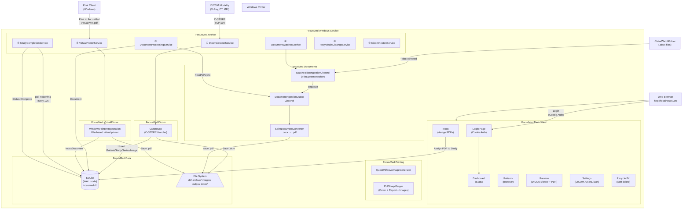
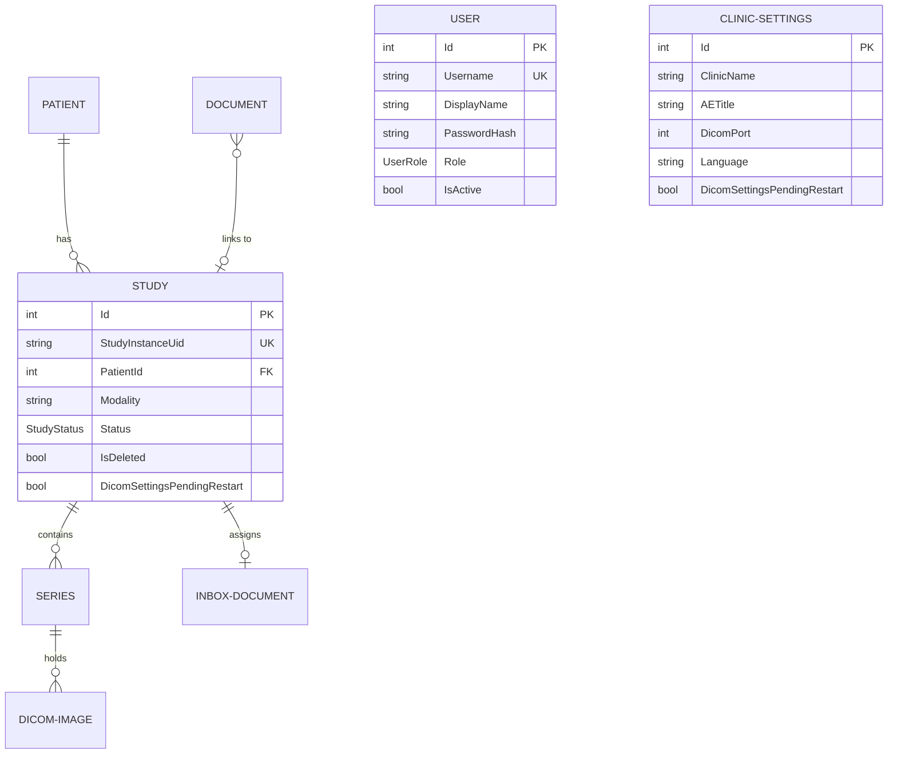

# FocusMed

**Focus** + **Med**ical — A Windows Background Service for medical imaging and reporting with a Razor Pages dashboard (Areas pattern). Receives DICOM images from medical devices (X-Ray, CT, MRI), ingests `.docx` reports from a watch folder, receives PDFs via a built-in Virtual Printer, generates a professional PDF (cover page + report + images), and prints silently to a local Windows printer. Includes a secure web dashboard at `http://localhost:5000`.

---

## Table of Contents

1. [What It Does](#what-it-does)
2. [System Architecture](#system-architecture)
3. [Project Structure](#project-structure)
4. [How Each Layer Works](#how-each-layer-works)
5. [Background Services](#background-services)
6. [Data Model](#data-model)
7. [Authentication & User Management](#authentication--user-management)
8. [Settings Dashboard](#settings-dashboard)
9. [Technology Stack](#technology-stack)
10. [File System Layout](#file-system-layout)
11. [Configuration Reference](#configuration-reference)
12. [Database & WAL Mode](#database--wal-mode)
13. [Build, Run & Migrations](#build-run--migrations)
14. [Core Optimizations](#core-optimizations)

---

## What It Does

FocusMed runs as a Windows Service and operates parallel, fully asynchronous pipelines, plus a secure Razor Pages dashboard:

| Pipeline               | I    nput                                             | Output                                                           |
| ---------------------- | ------------------------------------------------- | ---------------------------------------------------------------- |
| **DICOM Ingestion**    | Images from X-Ray / CT / MRI over TCP port 104    | `.dcm` archive + `.png` images + SQLite records                  |
| **Document Ingestion** | `.docx` files dropped into a watch folder         | Converted `.pdf` + SQLite `Document` record                      |
| **Virtual Printer**    | PDFs printed to "FocusMed" Windows printer        | PDF stored in `InboxDocument` waiting for assignment             |
| **Merge & Print**      | Generated directly via Study Preview             | Final merged PDF (cover + report + images) → silent print        |
| **Dashboard**          | Web browser at `http://localhost:5000`            | Secure study viewer, patient browser, inbox, settings, users     |

---

## System Architecture



---

## Project Structure

```
FocusMed/
├── FocusMed.slnx                         ← XML solution (not .sln)
├── AGENTS.md                             ← Architecture rules for AI agents
├── README.md                             ← This file
│
├── src/
│   ├── FocusMed.Data/                    ← Data access layer (EF Core 8 + SQLite)
│   ├── FocusMed.Dicom/                   ← DICOM network layer (fo-dicom)
│   ├── FocusMed.Documents/               ← Document watcher + Spire conversion
│   ├── FocusMed.Imaging/                 ← DICOM pixel → PNG conversion
│   ├── FocusMed.Printing/                ← PDF generation (QuestPDF + PdfSharpCore)
│   ├── FocusMed.VirtualPrinter/          ← File-based virtual printer registration
│   ├── FocusMed.Dashboard/               ← Razor Pages web interface (Areas pattern)
│   ├── FocusMed.Notifier/                ← Standalone WinForms tray app
│   └── FocusMed.Worker/                  ← Windows Service orchestrator
│
└── tests/
    └── (placeholder for FocusMed.Tests)
```

---

## How Each Layer Works

### FocusMed.Data

- **EF Core 8** with **SQLite** in **WAL mode** (Write-Ahead Logging).
- Repository pattern: every entity has an `IXxxRepository` + `XxxRepository` registered as **scoped**.
- SQLite WAL mode is configured via `WalModeInterceptor` on all database connections.
- `User` entity with BCrypt-hashed passwords for authentication.
- `ClinicSettings` singleton row with auto-seeding on first access.

### FocusMed.Dicom

- `CStoreScp` handles C-STORE requests: extracts DICOM tags → upserts `Patient → Study → Series → DicomImage` → saves `.dcm` → converts pixels to `.png`.
- Custom stable folder hashing (FNV-1a) is used to group study files deterministically.
- `DicomFileIngestionService` supports batch import from local folders.

### FocusMed.Documents

- **Producer-Consumer** pattern via `System.Threading.Channels`.
- `WatchFolderIngestionChannel` monitors for new `.docx` files.
- `FreeSpire.Doc` performs headless `.docx` → `.pdf` conversion (3-page / 500-paragraph free tier limit).

### FocusMed.VirtualPrinter

- **File-based virtual printer**: `WindowsPrinterRegistration` registers a "FocusMed" Windows printer using "Microsoft Print To PDF" driver with a file port.
- `VirtualPrinterService` uses `FileSystemWatcher` to detect `VirtualPrint.pdf`, reads it, saves to `data/inbox`, creates an `InboxDocument`.
- Requires Admin for PowerShell printer registration; failure is non-fatal.

### FocusMed.Printing

- **Cover page**: generated via QuestPDF using `pagegarde.docx` template (FreeSpire fallback).
- **PDF Merge**: PdfSharpCore appends cover, report, and DICOM images onto A4 pages.
- **Silent print**: PdfiumViewer submits to the Windows spooler.

### FocusMed.Dashboard

Razor Pages class library using the ASP.NET Core **Areas pattern**. All pages require authentication.

| Page | URL | Purpose |
|------|-----|---------|
| **Login** | `/login` | Cookie-based authentication (standalone, matches dashboard style) |
| **Dashboard** | `/dashboard` | System metrics, today's modality breakdown, recent studies |
| **Patients** | `/patients` | Searchable/filterable study directory (max 500 results) |
| **Inbox** | `/inbox` | Virtual Printer inbox — assign PDFs to patient studies |
| **Preview** | `/preview/{id}` | Full study viewer with drag-reorder, PDF generation, print |
| **Recycle Bin** | `/recyclebin` | Soft-deleted studies — restore or permanent delete |
| **Settings** | `/settings` | Clinic config, DICOM, file paths, user management (5 sections) |

---

## Background Services

| #   | Service                     | What it does |
| --- | --------------------------- | ------------ |
| 1   | `DicomListenerService`      | Opens TCP port 104 as the configured AE Title. Keeps the DICOM server alive. |
| 2   | `DocumentWatcherService`    | Calls `StartAsync` on every registered `IDocumentIngestionChannel`. |
| 3   | `DocumentProcessingService` | Drains `DocumentIngestionQueue`. Converts `.docx` to PDF, saves `Document` record. |
| 4   | `StudyCompletionService`    | Polls every 10s. Studies in `Receiving` older than stabilization window → `Complete`. |
| 5   | `VirtualPrinterService`     | Detects `VirtualPrint.pdf` via `FileSystemWatcher`, imports as inbox document. |
| 6   | `RecycleBinCleanupService`  | Every 12 hours. Permanently deletes soft-deleted studies > 30 days old. |
| 7   | `DicomRestartService`       | Polls every 5s. When DICOM settings change, waits for idle → restarts server. |

---

## Data Model



---

## Authentication & User Management

### Authentication

- **Cookie-based** ASP.NET Core authentication (no external packages needed).
- All dashboard pages require login (`[Authorize]` in `_ViewImports.cshtml`).
- Login page at `/login` — standalone, matches the dashboard's Tailwind/Alpine.js design.
- Session expires after 24 hours with sliding renewal.
- **Default credentials**: `admin` / `admin` (seeded on first run).

### Roles

| Role | Permissions |
|------|------------|
| **Admin** (doctor) | Full access: all settings sections, DICOM config, user management |
| **User** (technician) | View-only: Dashboard, Patients, Preview, Inbox. No settings access. |

### User Management (Admin only)

- Add new users with username, display name, password, and role.
- Activate/deactivate accounts.
- Delete users (cannot delete your own admin account).
- Passwords stored with BCrypt (salted, slow hash).

---

## Settings Dashboard

The Settings page (`/settings`) is a tabbed HTMX-driven interface with a left sidebar and right content area. It uses a single `SettingsModel` PageModel (`Settings.cshtml.cs`) with partial views for each section. All text is localized via `ILocalizationService` (`@Loc["..."]` tag helper) with English (`en.json`) and French (`fr.json`) translation files. The entire class is decorated with `[IgnoreAntiforgeryToken]` for HTMX form compatibility. Global `[Authorize]` (from `_ViewImports.cshtml`) requires login; the Users section is further gated by `IsAdmin`.

### Settings Code-Behind (`SettingsModel`)

The PageModel at `Settings.cshtml.cs` creates a scoped DI resolution per request via `IServiceScopeFactory`. It resolves two repositories:

- **`IClinicSettingsRepository`** — singleton settings row (`ClinicSettings` entity); auto-seeds default row on first access if none exists.
- **`IUserRepository`** — CRUD for `User` entities with BCrypt password hashing.

Key public properties exposed to the Razor view:

| Property | Type | Default | Purpose |
|---|---|---|---|
| `Settings` | `ClinicSettings?` | `null` | Full settings object loaded from DB |
| `Lang` | `string` | `"en"` | Current language code (extracted from `Settings.Language`) |
| `ActiveSection` | `string` | `"general"` | Which tab is active: `general`, `dicom`, or `users` |
| `Users` | `IReadOnlyList<User>?` | `null` | All users (loaded only for the `users` section) |
| `LocalIpAddress` | `string` | `"127.0.0.1"` | Server's local IPv4 (resolved via `Dns.GetHostEntry`) |
| `IsAdmin` | `bool` | computed | `true` if current user has the `"Admin"` role |

### Settings Page Handlers

#### GET Handlers

| Handler | Purpose |
|---|---|
| `OnGetAsync(section?)` | Main page load. Sets `ActiveSection` from query string (defaults `"general"`). Loads `ClinicSettings` from DB. For the General section, resolves the local IPv4 address. For the Users section (admin only), loads all users. |
| `OnGetDicomStatusAsync()` | HTMX polling endpoint. Returns an amber badge ("Restart pending...") if `DicomSettingsPendingRestart == true`, otherwise a green "Active" badge. Polled by the DICOM section every 3 seconds. |

#### POST Handlers

| Handler | Purpose |
|---|---|
| `OnPostLanguageAsync()` | Saves language (`"en"` / `"fr"`) to `ClinicSettings.Language`. Sets `HX-Refresh` header to trigger full page reload via HTMX. |
| `OnPostDicomAsync()` | Saves new AE Title and DICOM port to `ClinicSettings`. Sets `DicomSettingsPendingRestart = true`. Returns an inline amber status message. Port is validated as `int > 0`; AE Title must be non-empty. |
| `OnPostAddUserAsync()` | Creates a new user (Admin only). Validates: username, display name, and password required; password >= 6 chars; username must be unique. Hashes password with BCrypt. Returns `_UsersTable` partial for HTMX swap. |
| `OnPostToggleUserAsync(userId)` | Toggles `IsActive` on a user (Admin only). The default `"admin"` account is protected — cannot be deactivated. Returns updated `_UsersTable` partial. |
| `OnPostDeleteUserAsync(userId)` | Deletes a user (Admin only). The default `"admin"` account is protected — cannot be deleted. Returns updated `_UsersTable` partial. |
| `OnPostChangePasswordAsync(userId)` | Changes a user's password (Admin only). Validates min 6 chars. Directly sets `PasswordHash = BCrypt.Net.BCrypt.HashPassword(newPassword)` on the entity. Returns inline success/failure message. |

#### Private Helper

| Method | Purpose |
|---|---|
| `GetLocalIpAddress()` | Resolves the machine's hostname via `Dns.GetHostEntry()`, iterates addresses looking for the first IPv4 (`AddressFamily.InterNetwork`). Falls back to `"127.0.0.1"` on failure. |

### Settings Page Sections

The page uses `?section=` query parameters and a left sidebar nav to switch between three partial views:

#### 1. General (`_SettingsGeneral.cshtml`)
- **Language selector** — A `<select>` form that POSTs to `?handler=Language`. Choices: English (US), Francais.
- **Machines (DICOM Modalities) info card** — Read-only display of the local IP, AE Title, and DICOM port. This is informational for configuring CT/MRI machines to push to FocusMed.

#### 2. DICOM (`_SettingsDicom.cshtml`)
- **Server Status** — HTMX-polled live indicator (`hx-get="/settings?handler=DicomStatus" hx-trigger="every 3s"`). Shows Active (green) or Restart pending (amber with pulse animation).
- **AE Title** — Text input, current value from `Settings.AETitle`.
- **DICOM Port** — Number input (1–65535), current value from `Settings.DicomPort`.
- **Amber warning** — "Changing AE Title or port requires a server restart. The server will restart automatically when idle (no studies being received)."
- **Apply & Restart button** — Submits form via HTMX; result shown in `#dicom-result`.

#### 3. User Management — Admin Only (`_SettingsUsers.cshtml`)
- **Add User form** — POSTs to `?handler=AddUser`. Fields: Username, Display Name, Password (min 6), Role (User/Admin dropdown). HTMX swaps `#users-table`.
- **Users Table** (`_UsersTable.cshtml`) — Renders a table with columns:
  - **Username** — plain text
  - **Display Name** — plain text
  - **Role** — Blue badge for Admin, grey badge for User
  - **Status** — Green dot + "Active" or grey dot + "Inactive"
  - **Actions**:
    - Default `"admin"` account: Shows a shield icon with "Default Admin" label — no actions available.
    - Other users: Toggle Active/Inactive button (POST to `?handler=ToggleUser`) and Delete button (POST to `?handler=DeleteUser` with `hx-confirm` confirmation dialog). Both HTMX-swap `#users-table`.

### DICOM Auto-Restart Flow

When an admin changes AE Title or port in the Dashboard:

1. `OnPostDicomAsync()` saves settings to DB with `DicomSettingsPendingRestart = true`
2. `DicomRestartService` (background service) polls every 5 seconds
3. Checks if any studies have `Status == StudyStatus.Receiving` — if yes, waits (does not restart during active data flow)
4. When safe (no receiving studies), calls `IDicomServer.StopAsync()` then `StartAsync(newAeTitle, newPort)`
5. Sets `DicomSettingsPendingRestart = false` and saves to DB
6. Dashboard UI polls `OnGetDicomStatusAsync()` every 3 seconds to show the user whether restart is pending or complete

```
Admin saves DICOM settings in Dashboard
  → OnPostDicomAsync() sets DicomSettingsPendingRestart = true
  → DicomRestartService polls every 5s, detects flag
  → Waits for no active receiving studies
  → Restarts IDicomServer with new AE Title + port
  → Clears DicomSettingsPendingRestart flag
  → Dashboard UI polls OnGetDicomStatusAsync() every 3s to show status
```

### ClinicSettings Data Model

The `ClinicSettings` entity is a **singleton row** in the database (auto-seeded on first access):

| Property | Type | Default | Description |
|---|---|---|---|
| `Id` | `int` | auto | Primary key |
| `ClinicName` | `string` | `"FocusMed Clinic"` | Displayed on cover pages and reports |
| `AETitle` | `string` | `"FOCUSMED"` | DICOM Application Entity Title |
| `DicomPort` | `int` | `104` | TCP port for C-STORE connections |
| `ArchivePath` | `string` | `"archive"` | Root path for raw `.dcm` storage |
| `DatabasePath` | `string` | `"db/focusmed.db"` | Path to SQLite database |
| `ArchiveIntervalMonths` | `int` | `3` | Archive interval in months |
| `WatchFolderPath` | `string` | `@"C:\FocusMed\WatchFolder"` | Folder monitored for `.docx` files |
| `Language` | `string` | `"en"` | UI language (`"en"` or `"fr"`) |
| `ResumeText` | `string` | `""` | Medical text shown between cover page and images |
| `PrinterRegistered` | `bool` | `false` | Whether the virtual printer has been registered |
| `DicomSettingsPendingRestart` | `bool` | `false` | Flag for DICOM auto-restart flow |
| `UpdatedAt` | `DateTime` | `UtcNow` | Timestamp of last update |

### User Data Model

| Property | Type | Default | Description |
|---|---|---|---|
| `Id` | `int` | auto | Primary key |
| `Username` | `string` | `""` | Unique index enforced |
| `DisplayName` | `string` | `""` | Friendly name |
| `PasswordHash` | `string` | `""` | BCrypt-hashed password |
| `Role` | `UserRole` | `UserRole.User` | Enum: `Admin = 0`, `User = 1` |
| `IsActive` | `bool` | `true` | Whether the account can log in |
| `CreatedAt` | `DateTime` | `UtcNow` | Account creation timestamp |

### How Background Services Consume Settings

| Service | Setting Used | How |
|---|---|---|
| `DicomListenerService` | `AETitle`, `DicomPort` | On startup: reads `appsettings.json` first, then overrides with DB values if available. Calls `IDicomServer.StartAsync(aeTitle, port)`. |
| `DicomRestartService` | `DicomSettingsPendingRestart`, `AETitle`, `DicomPort` | Polls DB every 5s. When flag is true and no studies are receiving, stops and restarts the DICOM server with new settings. Clears the flag. |
| `VirtualPrinterService` | `WatchFolderPath` | Reads at startup to configure `FileSystemWatcher` for `VirtualPrint.pdf`. |

### Settings Files Reference

| File | Path |
|---|---|
| PageModel (code-behind) | `src/FocusMed.Dashboard/Areas/Dashboard/Pages/Settings.cshtml.cs` |
| Razor view | `src/FocusMed.Dashboard/Areas/Dashboard/Pages/Settings.cshtml` |
| General partial | `src/FocusMed.Dashboard/Areas/Dashboard/Pages/Shared/_SettingsGeneral.cshtml` |
| DICOM partial | `src/FocusMed.Dashboard/Areas/Dashboard/Pages/Shared/_SettingsDicom.cshtml` |
| Users partial | `src/FocusMed.Dashboard/Areas/Dashboard/Pages/Shared/_SettingsUsers.cshtml` |
| Users table partial | `src/FocusMed.Dashboard/Areas/Dashboard/Pages/Shared/_UsersTable.cshtml` |
| ClinicSettings model | `src/FocusMed.Data/Models/ClinicSettings.cs` |
| IClinicSettingsRepository | `src/FocusMed.Data/Services/IClinicSettingsRepository.cs` |
| ClinicSettingsRepository | `src/FocusMed.Data/Services/ClinicSettingsRepository.cs` |
| User model | `src/FocusMed.Data/Models/User.cs` |
| UserRole enum | `src/FocusMed.Data/Models/UserRole.cs` |
| IUserRepository | `src/FocusMed.Data/Services/IUserRepository.cs` |
| UserRepository | `src/FocusMed.Data/Services/UserRepository.cs` |
| DicomListenerService | `src/FocusMed.Worker/Services/DicomListenerService.cs` |
| DicomRestartService | `src/FocusMed.Worker/Services/DicomRestartService.cs` |
| English translations | `src/FocusMed.Dashboard/Resources/en.json` |
| French translations | `src/FocusMed.Dashboard/Resources/fr.json` |

---

## Technology Stack

| Package                                      | Version                  | Purpose                                     |
| -------------------------------------------- | ------------------------ | ------------------------------------------- |
| .NET                                         | 10.0 (`net10.0-windows`) | Runtime — Windows-only for printing support |
| fo-dicom                                     | 5.1.2                    | DICOM C-STORE SCP network server            |
| FreeSpire.Doc                                | 14.4.0                   | Headless `.docx → PDF` (No Word required)   |
| QuestPDF                                     | 2024.10.2                | Fluent A4 PDF cover + dashboard PDF gen     |
| PdfSharpCore                                 | 1.3.67                   | PDF merging (append pages + draw images)    |
| PdfiumViewer                                 | 2.13.0                   | Silent PDF printing via Windows spooler     |
| EF Core SQLite                               | 8.0.0                    | Database engine (WAL mode)                  |
| BCrypt.Net-Next                              | 4.0.3                    | Password hashing (bcrypt)                   |
| ASP.NET Core Razor Pages                     | 10.0                     | Interactive web dashboard (Areas pattern)   |

---

## File System Layout

```
./data/
├── WatchFolder/          ← Drop .docx files here (also VirtualPrint.pdf lands here)
├── Documents/            ← Converted PDFs (.docx → .pdf output)
├── Output/               ← Final merged PDFs (Cover + Report + Images)
├── db/
│   └── focusmed.db       ← SQLite database (WAL mode)
├── archive/              ← Raw .dcm files organized by Patient/Study/Series
├── images/               ← Converted PNG files (mirror of archive structure)
└── inbox/                ← PDFs captured from the Virtual Printer
```

---

## Configuration Reference

Settings live in `src/FocusMed.Worker/appsettings.json` (also overridden by the database `ClinicSettings` table — DB takes precedence for most settings at runtime):

| Key                         | Default                   | Description                                            |
| --------------------------- | ------------------------- | ------------------------------------------------------ |
| `DicomPort`                 | `104`                     | TCP port the DICOM C-STORE SCP listens on              |
| `AETitle`                   | `FOCUSMED`                | DICOM Application Entity Title                         |
| `DatabasePath`              | `data/db/focusmed.db`     | Path to SQLite database file                           |
| `ArchivePath`               | `data/archive`            | Root path for raw `.dcm` file storage                  |
| `WatchFolderPath`           | `data/WatchFolder`        | Folder monitored for incoming `.docx` files            |
| `StudyStabilizationSeconds` | `30`                      | Config-only: seconds before a study is marked Complete |

---

## Database & WAL Mode

FocusMed uses SQLite in **WAL (Write-Ahead Logging)** mode for safe concurrent access between background services and the Dashboard.

**WAL PRAGMAs** (applied on every connection):
```sql
PRAGMA journal_mode = WAL;
PRAGMA busy_timeout = 5000;
PRAGMA synchronous  = NORMAL;
PRAGMA cache_size   = -64000;   -- 64 MB
PRAGMA foreign_keys = ON;
```

### Tables

| Table | Purpose |
|-------|---------|
| `Patients` | Patient demographics (ID, name, DOB, sex) |
| `Studies` | DICOM studies with status tracking and soft delete |
| `Series` | DICOM series within studies |
| `Images` | Individual DICOM images with file paths |
| `Documents` | Converted `.docx` reports linked to studies |
| `InboxDocuments` | Virtual Printer PDFs awaiting assignment |
| `ClinicSettings` | Singleton config row (auto-seeded) |
| `Users` | Auth users with BCrypt-hashed passwords |

### Performance Indexes

To ensure the system scales efficiently under large DICOM workloads, database indexes are defined on critical search, filter, and sorting columns:
- **`Patient`**: `PatientId` (index), `Name` (index)
- **`Study`**: `StudyInstanceUid` (unique index), `StudyDate` (index), `Modality` (index), `Status` (index), `IsDeleted` (index), `AccessionNumber` (index), `CreatedAt` (index), `DeletedAt` (index)
- **`Series`**: `SeriesInstanceUid` (unique index)
- **`DicomImage`**: `SopInstanceUid` (unique index)
- **`Document`**: `Status` (index), `ReceivedAt` (index), `StudyId` (index)
- **`User`**: `Username` (unique index)

### Migrations

```bash
# Add a new migration
dotnet ef migrations add <MigrationName> --project src\FocusMed.Data --startup-project src\FocusMed.Worker

# Apply migrations (also runs automatically on startup via db.Database.Migrate())
dotnet ef database update --project src\FocusMed.Data --startup-project src\FocusMed.Worker
```

---

## Build, Run & Migrations

```bash
# Restore all NuGet packages
dotnet restore D:\FocusMed\FocusMed.slnx

# Build the entire solution
dotnet build D:\FocusMed\FocusMed.slnx

# Run in console mode (keeps running until Ctrl+C)
dotnet run --project src\FocusMed.Worker

# Run with auto-reload on code changes (locks prevented)
dotnet watch run --project src\FocusMed.Worker
```

> **Important:** Use `D:\FocusMed\FocusMed.slnx` (not `.sln`). Tools that expect `.sln` will fail.

### First Run

1. The app seeds a default `admin` / `admin` user
2. Open `http://localhost:5000` — redirects to login
3. Sign in with `admin` / `admin`
4. Navigate to Settings → DICOM to configure your modality connection

---

## Core Optimizations & UI Enhancements

1. **File Locks during `dotnet watch`** — `<UseAppHost>false</UseAppHost>` prevents DLL lock errors on `pdfium.dll` during live development.
2. **Stable Directory Hashing (FNV-1a)** — Deterministic folder names survive database/process restarts.
3. **Hyper-Fast PDF Generation** — Server-side image resizing + JPEG compression at 75% quality. PDFs compile in < 2 seconds.
4. **Zero Thumbnail 404 Errors** — Preview sidebar loads optimized PNGs directly.
5. **Assignment Workflow** — Linking a Virtual Printer PDF redirects directly to the study preview.
6. **Unified Search & Filtering** — Filter bars in Patients and Recycle Bin offer a single, powerful search field for Patient Name, Patient ID, and Accession Number, coupled with start and end date ranges.
7. **Filter State Preservation** — Filters are stored in `sessionStorage` and restored automatically when navigating back to the page. HTMX updates the lists dynamically via triggered events upon restoration.
568. **Scrollable Filters** — Filter bars scroll natively with the page content for a cleaner, non-intrusive viewing experience.
569. **Vulnerability Suppression** — NuGet audit advisories (such as `SixLabors.ImageSharp` and `SQLitePCLRaw.lib.e_sqlite3`) are explicitly suppressed in `Directory.Build.props` to avoid warnings and build-blockages during active `dotnet watch` live development sessions.
570. **Crash Safety** — Global `UnhandledException` and `UnobservedTaskException` handlers in `Program.cs` cleanly exit the service on fatal errors instead of looping. Service loops execute within safe `try/catch` blocks.
571. **Manual Stop Page** — A dedicated `/system-stop` page accessible via the sidebar to gracefully stop the background services and the Kestrel host via `IHostApplicationLifetime`.
572. **GitHub Auto-Update & Notifier Tray App** — `UpdateCheckerService` polls GitHub for new releases. `FocusMed.Notifier` (a standalone WinForms tray app) alerts the user to updates, and instantly pops up when a printed report arrives. To prevent state desync, the `FocusMed.Worker` explicitly terminates and restarts the tray app during any backend restarts.
